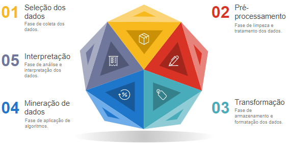
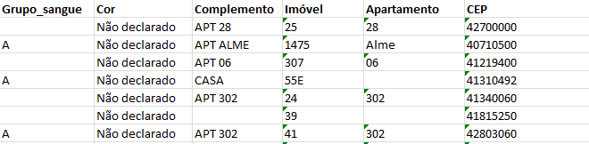
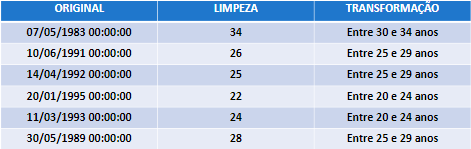
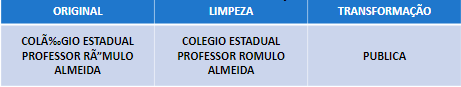
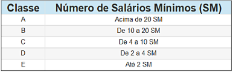
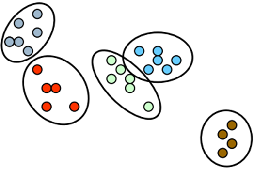
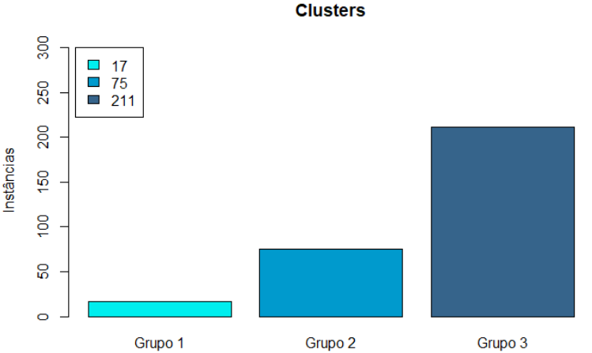
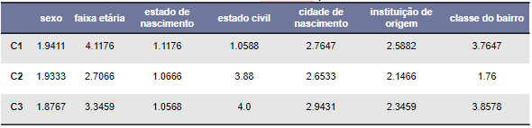
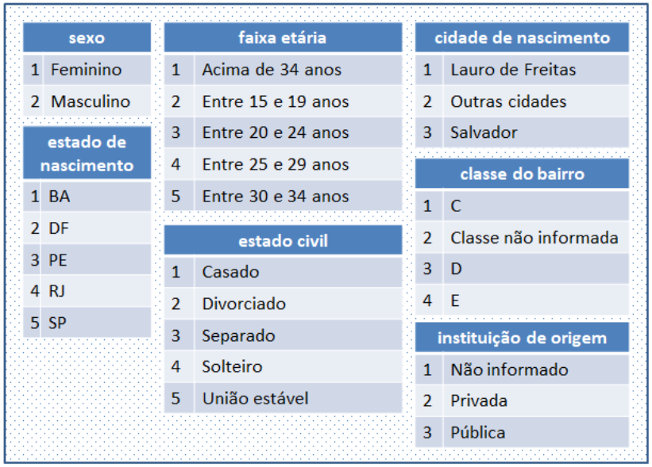
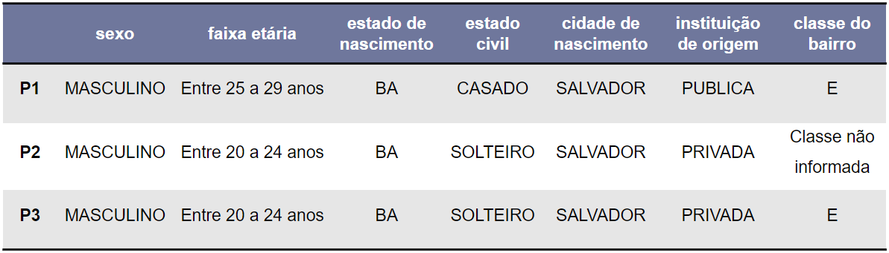

# Clustering-KDD
Clustering using the K-Means algorithm and Calinski-Harabasz index, following KDD process.

Resumo: Esse projeto apresenta um estudo que teve como objetivo a identificação de perfis de alunos dos cursos de Tecnologia da Informação, de uma instituição privada, seguindo o processo KDD (*Knowledge Discovery in Databases*), realizado a partir da utilização do algoritmo K-Means na etapa de mineração de dados. O resultado atingido foi o agrupamento de 3 clusters, estabelecidos a partir da utilização do índice de Calinski-Harabasz, indicando os perfis identificados.
###### *Abstract: This project presents a study, which had the objective of observing and identifying students of Information Technology courses from a private institution, following the KDD process (Knowledge Discovery in Databases), using the K-Means algorithm in the data mining step. The result was the clustering of 3 clusters established using Calinski-Harabasz index, which indicate the indentified profiles.)*

Objetivos:
- Identificação de variáveis relevantes;
- Descrição de perfis;
- Comparação de perfis;

Tecnologias: 

  

# Descoberta de Conhecimento em Base de Dados

_Knowledge Discovery in Databases_ \- KDD

# Seleção de dados
* Dados fornecidos pela Universidade;
* 23 atributos;
* Alunos de todas as turmas, de todos os cursos;
* Período de 2012 a 2017

## Seleção dos atributos
Os atributos selecionados foram: sexo, faixa etária, estado de nascimento, estado civil, bairro, cidade de nascimento, curso da universidade e instituição de origem.

Os atributos descartados foram: matrícula, país de nascimento, naturalização, grupo sanguíneo, fator RH, cor, logradouro, complemento, imóvel, apartamento, CEP, cidade da instituição de origem e país da instituição de origem.

## Atributos descartados
* Valores não declarados
* Dados exclusivos por instância
* Alto nível de _outliers_

Exemplo de valores dos atributos que foram descartados:

# Limpeza de dados
Fase de limpeza e tratamento dos dados. Nessa etapa, os dados redundantes, ausentes e inconsistentes são tratados. Neste processo também podem ser utilizadas técnicas de redução e transformação.

Apenas os alunos dos cursos de informática foram selecionados, sendo dos seguintes cursos:
- Graduação Superior Tecnológica em Análise e Desenvolvimento de Sistemas;
- Bacharelado em Engenharia de Software;
- Bacharelado em Sistemas da Informação.

Os cursos citados foram os únicos disponibilizados na base entre o período de 2012 até 2017.

Os atributos sexo, estado civil, bairro, cidade de nascimento, curso da universidade e instituição de origem passaram por tratamento de dados inconsistentes e padronização das unidades.

__1\.__ __Dados__  __inconsistentes:__
- Valores ausentes;
- Abreviações inapropriadas;
- Erros de ortografia/gramática;
- Valores em campos inadequados.

__2\.__  __Padronização__  __das__  __unidades:__
- Texto formatado para maiúsculo;
- Remoção de acentos;
- Remoção de caracteres especiais;
- Concordância de gênero;
- Abreviação apropriada.

# Transformação
Fase de armazenamento e formatação dos dados. Nessa etapa é possível acrescentar dados que sejam necessários para análise dentro do conjunto de dados, transformando ou combinando de outros conjuntos.

O atributo de faixa etária, baseado na faixa etária do IBGE, foi tratado da seguinte forma:

O atributo de instituição de origem foi classificado como: PRIVADA, PÚBLICA e NÃO INFORMADO.

## Acréscimo de dados

Para efetivar os resultados da pesquisa, fez-se necessário o acréscimo da classificação dos bairros, adicionando um atributo de classe, a partir dos dados socioeconômicos dos 163 bairros de Salvador/BA, cadastrados pelo IBGE.

Tabela de classificação por número de salários mínimos:

# Mineração de dados
Fase de aplicação de algoritmos. Nessa etapa, os dados são explorados com a utilização de algoritmos, que podem ser estabelecidos a partir de técnicas de mineração de dados. É um processo que explora e modela grandes bancos de dados com o objetivo de extrair padrões a partir de uma base de dados grande e complexa.

## Técnicas utilizadas
- Análise de agrupamento
- Análise de Silhueta
- Índice de Calinski-Harabasz
- K-Means

## Análise de agrupamento
Normalmente chamada de _clustering_, verifica relações existentes dentro de um conjunto de dados, dividindo-os em grupos, analisando similaridades e discrepâncias entre elementos de um mesmo grupo ou de grupos diferentes.

## Análise de Silhueta
Do francês _Silhouette_, determina e valida um número de _cluster_, estabelecendo similaridades e discrepâncias entre elementos, selecionando o melhor algoritmo para ser executado no conjunto de dados. O resultado do índice varia entre -1 (agrupamento ruim) e 1 (agrupamento ótimo).
Os algoritmos comparados foram: _HIERARCHICAL_, _K-MEANS_, _MODEL_, _SOTA_ e _CLARA_. O de melhor resultado foi o K-Means.

## Índice de Calinski-Harabasz
Compara a similaridade e isolamento dos grupos, avaliando a qualidade do _cluster_ e indicando o número essencial de grupos com base na maximação do valor de CH. O melhor número de _clusters_ para ser aplicado foi 3.

## K-Means
O objetivo desse algoritmo é agrupar os elementos, funcionando da seguinte forma:
1. Agrupam-se os dados em K grupos, onde K é pré definido;
2. Seleciona o número de ponto, aleatoriamente, como centro dos _clusters_;
3. Atribui-se uma medida de distância;
4. Calcula o centroide (ou média dos dados em cada _cluster_), agrupando os elementos aos _clusters_ que possuírem menor distância entre si;
5. Representa as partições descobertas.

Os parâmetros de entrada do _k-means_ foram: conjunto de dados, número de grupos pré definido (3) e o número de interação entre os centroides (100).

# Interpretação e Análise
Fase de análise e interpretação dos dados. Essa etapa estabelece o conhecimento gerado a partir da análise e interpretação dos resultados obtidos.

__- _Clusters_ por instâncias:__

__– Média dos centroides por cluster:__

__- Dicionário de dados:__
Dicionário que identifica os perfis a partir da média dos centroides.

__– Perfis estabelecidos:__

# Conclusão
- Levantamento de perfis dos alunos dos cursos superiores de Tecnologia da Informação de uma universidade privada, no período de 2012 a 2017, estabelecendo grupos de alunos com a utilização da metodologia e técnicas de Mineração de Dados, segundo o KDD;
- Identificação de grupos com diferentes perfis traçados, observando que o maior grupo possui 69,63% da quantidade de alunos que foram apurados para realização da pesquisa;
- O maior grupo foi de pessoas do sexo masculino, com idades entre 20 e 24 anos, nascidas em Salvador/BA, solteiros, estudantes oriundos de instituições privadas e residentes de bairros classe E;
- O estudo serve de colaboração para a área de educação superior, pois possibilita a universidade avaliar o perfil de estudantes ingressos nos cursos, mediante dados informados no período de matrícula;
- Serve de conhecimento para colaborar na localização de quais tipos de instituições a universidade pode realizar visitações;
- Mostra a potencialidade do uso da mineração de dados no contexto acadêmico para gerar conhecimento para professores e gestores.
